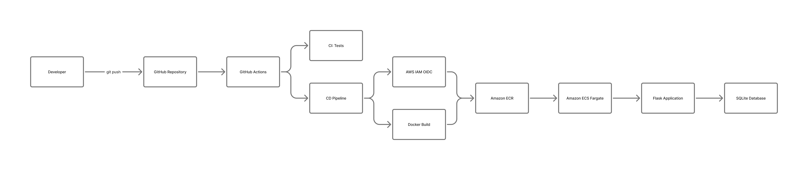
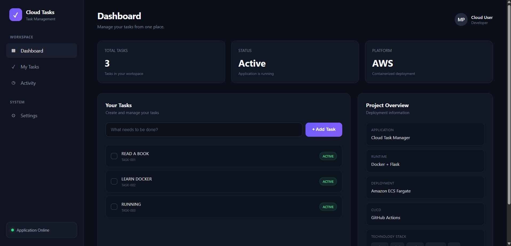
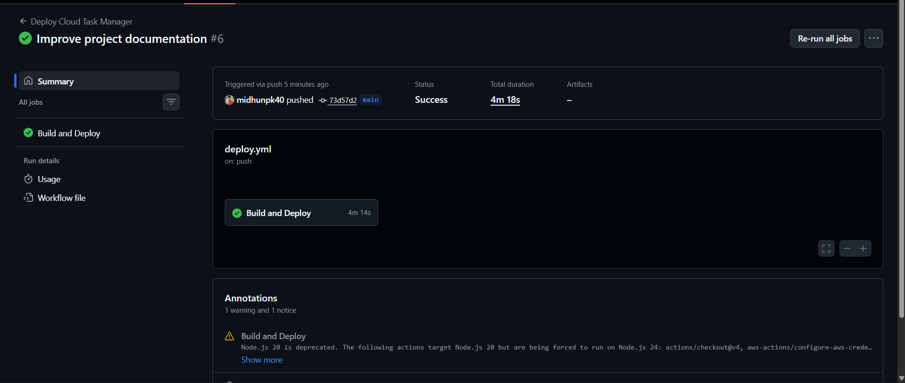
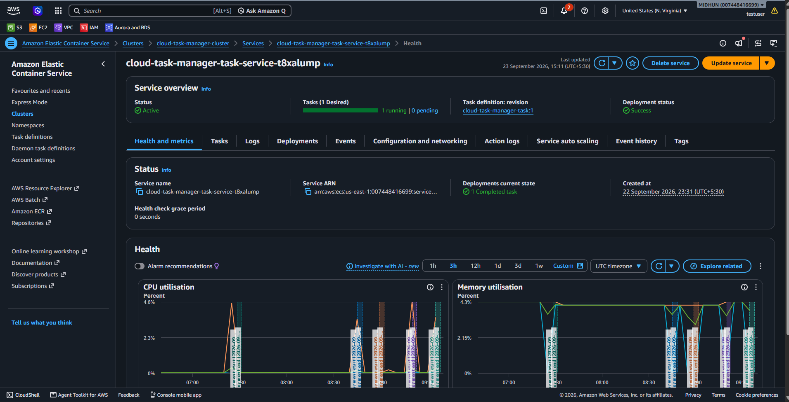
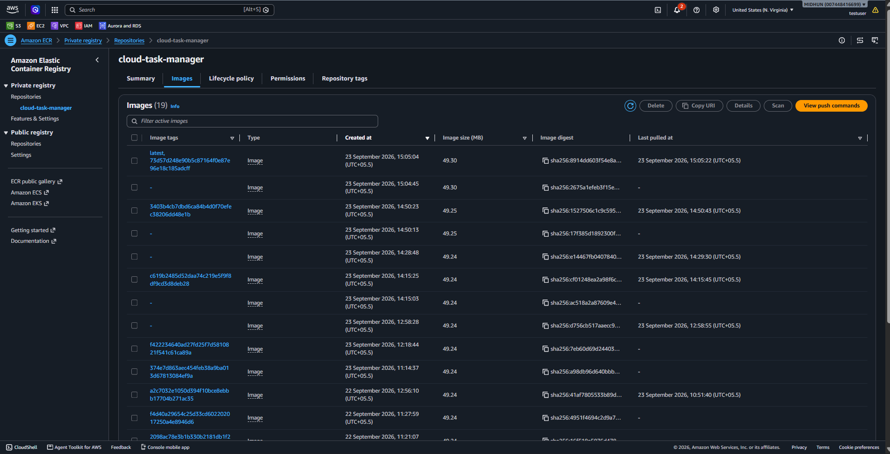

# ☁️ Cloud Task Manager

A containerized task management web application deployed on **AWS ECS Fargate** with an automated **GitHub Actions CI/CD pipeline**.

The project demonstrates a practical cloud deployment workflow using Docker, Amazon ECR, Amazon ECS, IAM OIDC, GitHub Actions, and AWS networking/security concepts.

---

## 🏗️ Architecture



### Deployment Flow

```text
Developer
    │
    ▼
GitHub Repository
    │
    ▼
GitHub Actions
    │
    ├── CI → Test Application
    │
    └── CD
         │
         ├── Authenticate with AWS using OIDC
         │
         ├── Build Docker Image
         │
         ├── Push Image → Amazon ECR
         │
         └── Deploy → Amazon ECS Fargate
                              │
                              ▼
                       Flask Application
                              │
                              ▼
                         SQLite Database
```

---

## 🚀 Live Deployment

The application is deployed as a Docker container on **Amazon ECS Fargate**.

The deployment process is automated through GitHub Actions:

```text
Git Push
   ↓
GitHub Actions
   ↓
Docker Build
   ↓
Amazon ECR
   ↓
Amazon ECS Fargate
   ↓
Running Flask Application
```

---

## 🛠️ Technology Stack

### Application

* Python
* Flask
* SQLite
* HTML
* CSS
* Jinja2

### Containerization

* Docker
* Docker Hub-compatible container workflow
* Amazon ECR

### AWS

* Amazon ECS
* AWS Fargate
* Amazon ECR
* IAM
* IAM OIDC
* VPC
* Security Groups

### CI/CD

* GitHub Actions
* GitHub Actions OIDC authentication
* Automated Docker build
* Automated ECR push
* Automated ECS deployment

---

## ✨ Features

* Create tasks through a web interface
* Display stored tasks
* SQLite-based task storage
* Responsive dashboard interface
* Dockerized Flask application
* AWS Fargate deployment
* Automated CI/CD pipeline
* Secure GitHub-to-AWS authentication using OIDC

---

## 📸 Project Screenshots

### Deployed Application



### GitHub Actions CI/CD



### Amazon ECS Fargate



### Amazon ECR



---

## 🔄 CI/CD Pipeline

The project uses GitHub Actions to automate the deployment process.

Whenever code is pushed to the `main` branch:

### 1. Checkout

GitHub Actions checks out the latest source code.

### 2. AWS Authentication

GitHub Actions assumes an AWS IAM role using **OIDC federation**.

No long-lived AWS access keys are stored in GitHub.

### 3. Docker Build

The application is packaged into a Docker image.

```bash
docker build -t cloud-task-manager:latest .
```

### 4. Push to Amazon ECR

The Docker image is tagged and pushed to the ECR repository.

```text
Amazon ECR
└── cloud-task-manager
    └── latest
```

### 5. ECS Deployment

The ECS service is forced to start a new deployment using the latest container image.

### 6. Deployment Verification

GitHub Actions waits for the ECS service to reach a stable state.

---

## 🔐 GitHub Actions OIDC

The project uses **GitHub Actions OIDC federation** to authenticate with AWS.

Instead of storing permanent AWS access keys inside GitHub Secrets:

```text
GitHub Actions
      │
      │ OIDC Token
      ▼
AWS IAM
      │
      │ Assume Role
      ▼
Temporary AWS Credentials
      │
      ▼
ECR + ECS
```

This avoids storing long-lived AWS credentials in the repository.

The GitHub repository is restricted in the IAM trust policy so that the deployment role can only be assumed by the intended repository and branch.

---

## 🐳 Docker

The application is packaged using Docker.

### Dockerfile

```dockerfile
FROM python:3.12-slim

WORKDIR /app

COPY . .

RUN pip install --no-cache-dir flask

EXPOSE 5000

CMD ["python", "app.py"]
```

### Build Locally

```bash
docker build -t cloud-task-manager:latest .
```

### Run Locally

```bash
docker run -p 5000:5000 cloud-task-manager:latest
```

The application can then be accessed at:

```text
http://localhost:5000
```

---

## ☁️ AWS Deployment

The application runs using:

```text
Amazon ECS
      │
      └── AWS Fargate
              │
              └── Docker Container
                       │
                       └── Flask Application
```

### ECS Configuration

| Component        | Configuration |
| ---------------- | ------------- |
| Compute          | AWS Fargate   |
| CPU              | 0.25 vCPU     |
| Memory           | 0.5 GiB       |
| Application Port | 5000          |
| Container        | Docker        |
| Application      | Flask         |
| Database         | SQLite        |

---

## 📦 Amazon ECR

The Docker image is stored in Amazon Elastic Container Registry.

```text
007448416699.dkr.ecr.us-east-1.amazonaws.com/cloud-task-manager:latest
```

The CI/CD pipeline automatically pushes the latest image to this repository.

### Manual ECR Deployment

AWS authentication:

```bash
aws sts get-caller-identity --query Account --output text
```

Authenticate Docker with ECR:

```bash
aws ecr get-login-password --region us-east-1 | \
docker login \
--username AWS \
--password-stdin \
"$ACCOUNT_ID.dkr.ecr.us-east-1.amazonaws.com"
```

Tag the image:

```bash
docker tag cloud-task-manager:latest \
"$ACCOUNT_ID.dkr.ecr.us-east-1.amazonaws.com/cloud-task-manager:latest"
```

Push the image:

```bash
docker push \
"$ACCOUNT_ID.dkr.ecr.us-east-1.amazonaws.com/cloud-task-manager:latest"
```

---

## 🔒 Security

The project applies several basic cloud security practices:

* AWS IAM used for access control
* GitHub Actions authenticated through OIDC
* No permanent AWS access keys stored in GitHub
* ECS task protected using a Security Group
* Application port restricted through Security Group rules
* AWS credentials are not included in source code

---

## 📁 Project Structure

```text
cloud-task-manager/
│
├── .github/
│   └── workflows/
│       ├── ci.yml
│       └── deploy.yml
│
├── screenshots/
│   ├── dashboard.png
│   ├── github-actions.png
│   ├── ecs-service.png
│   └── ecr.png
│
├── templates/
│   └── index.html
│
├── app.py
├── Dockerfile
├── README.md
├── architecture.png
└── tasks.db
```

---

## 💻 Local Development

### Clone Repository

```bash
git clone https://github.com/midhunpk40/cloud-task-manager.git
cd cloud-task-manager
```

### Create Virtual Environment

```bash
python -m venv venv
```

### Activate on Windows

```powershell
venv\Scripts\activate
```

### Install Flask

```bash
pip install flask
```

### Run Application

```bash
python app.py
```

Open:

```text
http://localhost:5000
```

---

## 🗄️ Database

The application currently uses SQLite for simplicity.

Tasks are stored in:

```text
tasks.db
```

The application creates the database table automatically when the application starts.

### Important Limitation

SQLite is stored inside the container's filesystem.

Because ECS Fargate tasks use ephemeral storage, data should **not** be considered persistent across task replacement.

This is intentional for this learning project.

For a production architecture, the database could be replaced with:

* Amazon RDS
* Amazon DynamoDB

---

## 📊 Current Architecture vs Production Architecture

### Current Learning Architecture

```text
GitHub
   ↓
GitHub Actions
   ↓
Amazon ECR
   ↓
ECS Fargate
   ↓
Flask
   ↓
SQLite
```

### Possible Production Architecture

```text
GitHub
   ↓
GitHub Actions
   ↓
Amazon ECR
   ↓
Application Load Balancer
   ↓
ECS Fargate
   ↓
Amazon RDS / DynamoDB
```

Additional production improvements could include:

* Private ECS networking
* HTTPS with ACM
* Custom domain using Route 53
* CloudWatch monitoring and logging
* Health checks
* Least-privilege IAM policies
* Immutable Docker image tags
* Automated rollback
* Infrastructure as Code using Terraform

---

## 🎯 Learning Outcomes

This project provided practical experience with:

* Containerizing a Python web application
* Writing and using Dockerfiles
* Building Docker images
* Working with Amazon ECR
* Deploying containers using ECS Fargate
* Configuring AWS Security Groups
* Understanding AWS IAM
* Implementing GitHub Actions OIDC
* Creating CI/CD workflows
* Automating Docker image deployment
* Understanding container-based cloud deployment
* Working with ephemeral container storage
* Documenting cloud architecture

---

## 🔮 Future Improvements

Potential improvements include:

1. Add an Application Load Balancer
2. Add HTTPS using AWS Certificate Manager
3. Add a custom Route 53 domain
4. Replace SQLite with Amazon RDS or DynamoDB
5. Add CloudWatch logging and monitoring
6. Implement ECS health checks
7. Use least-privilege IAM policies
8. Use immutable Docker image tags based on Git commit SHA
9. Add automated rollback
10. Manage infrastructure using Terraform
11. Add separate development and production environments

---

## 📌 Project Purpose

This project was built as a practical **Cloud/DevOps portfolio project** to demonstrate the complete lifecycle of deploying a containerized application to AWS.

Rather than deploying the application manually, the project focuses on automation:

```text
Code
 ↓
Git
 ↓
CI
 ↓
Docker
 ↓
ECR
 ↓
ECS Fargate
 ↓
Running Application
```

The project demonstrates how a developer can move from source code to a running cloud application using modern container and CI/CD practices.

---

## 👨‍💻 Author

**Midhun P K**

B.Tech Computer Science & Engineering — 2026

GitHub: `midhunpk40`

---

## ⭐ Highlights

* 🐳 Dockerized Flask application
* ☁️ AWS ECS Fargate deployment
* 📦 Amazon ECR container registry
* 🔄 GitHub Actions CI/CD
* 🔐 GitHub OIDC → AWS IAM authentication
* 🛡️ AWS Security Groups
* 🗄️ SQLite database
* 📊 Architecture documentation
* 📸 Deployment evidence through project screenshots

---

## ⚠️ Project Scope

This is a **learning and portfolio project**, not a production-grade architecture.

The implementation intentionally keeps infrastructure simple and cost-conscious while demonstrating practical AWS, Docker, and CI/CD concepts.
